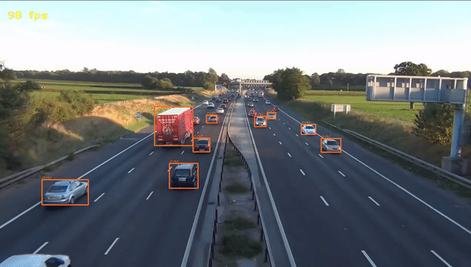

# TensorRT-YOLOv6
This repo provides the C++ implementation of [YOLOv6](https://github.com/meituan/YOLOv6) based on TensorRT for performing object detection in real-time.
<p align="center">
  
</p>

## Environment
- Windows 10
- Visual Studio 2017
- RTX 3070 GPU
- TensorRT 7.2.1.6
- CUDA 11.1, Cudnn 8
- OpenCV 4.5.1 with CUDA

## Benchmark
The following result obtained after performing inference 1000 iterations. It includes image pre-processing, model inference and post-processing (non-max suppression) times. The resolution of the input video was 1280x720 which can be downloaded from [Youtube](https://www.youtube.com/watch?v=wqctLW0Hb_0&t=1214s).

| Model | Device | Mode | Input Shape(HxW) | FPS |
|-|-|:-:|:-:|:-:|
| YOLOv6-n | RTX3070 | FP16 | 640x640 | 214 |
| YOLOv6-n | RTX3070 | FP32 | 640x640 | 165 |
| YOLOv6-tiny | RTX3070 | FP16 | 640x640 | 193 |
| YOLOv6-tiny | RTX3070 | FP32| 640x640 | 128 |
| YOLOv6-s | RTX3070 | FP16 | 640x640 | 130 |
| YOLOv6-s | RTX3070 | FP32 | 640x640 | 115 |

## Tutorial

- Step1: Download a pretrained onnx model from the YOLOv6 [release](https://github.com/meituan/YOLOv6/releases/tag/0.1.0)

- Step2: Open the solution with Visual Studio and select `x64` and `Release` for the configuration

- Step3: Go to where function `initializeSampleParams()` is defined and modify parameters 

```cpp
    // The engine file to generate or to load
    // The engine file does not exist:
    //     This program will try to load onnx file and convert onnx into engine
    // The engine file exists:
    //     This program will load the engine file directly
    params.engingFileName = "yolov6s.engine";

    // The onnx file to load
    params.onnxFileName = "yolov6s.onnx";
    
    // Number of classes (usually 80, but can be other values)
    params.outputClsSize = 80;
    
    // Input video filename
    params.inputVideoName = "road_traffic.mp4";
    // Model class filename
    params.cocoClassNamesFileName = "coco.names";
    
    // Threshold values
    params.confThreshold = 0.3;
    params.nmsThreshold = 0.5;
    
    // Floating point precision
    //     By default, fp32
    params.fp16 = true; 
```
## Comparison
Here we can see the comparison between YOLOv6n and YOLOv5n models:
<p align="center">
  
</p>

## Todo
- [x] Benchmark Test with different yolov6 versions 
- [ ] Preprocessing & postprocessing using CUDA
- [ ] Documentation
- [ ] Fix arguments (some of the parameters like model input size (640x640) hard-coded)

## Reference
  - based on [yolov4_deepstream](https://github.com/NVIDIA-AI-IOT/yolov4_deepstream/tree/master/tensorrt_yolov4) source
  - [YOLOv6](https://github.com/meituan/YOLOv6)
